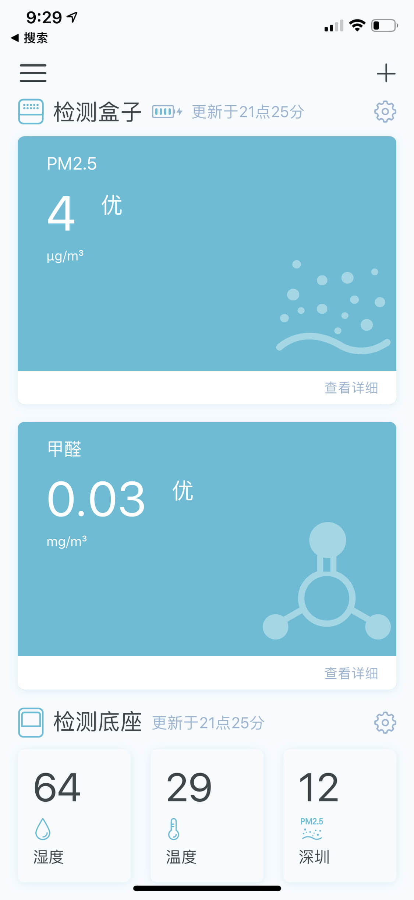
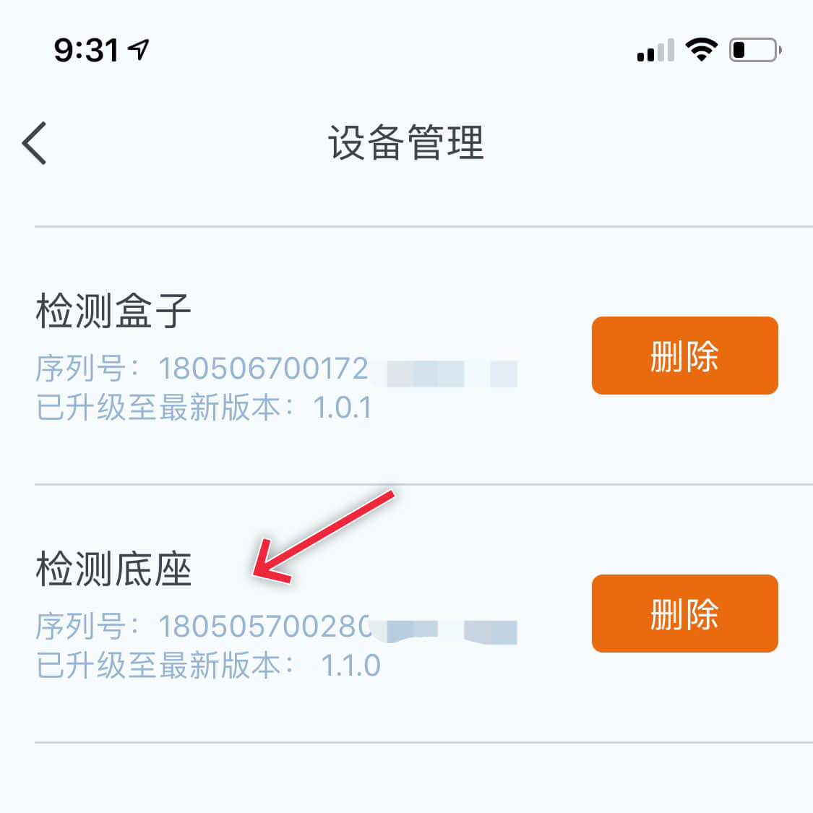
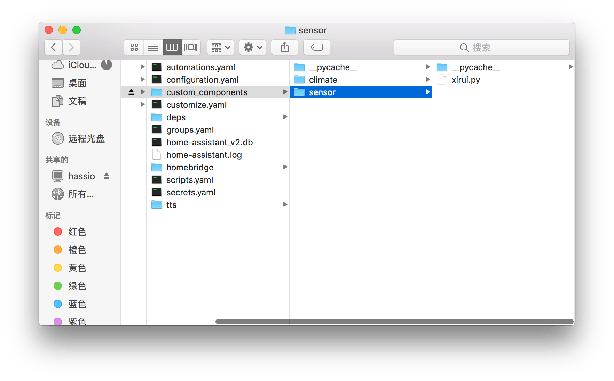
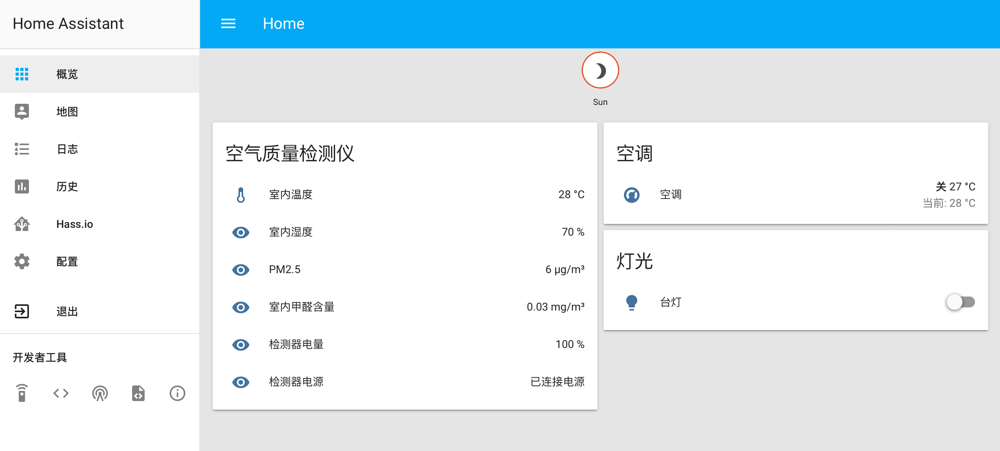

这个插件用于给西门子西睿空气质量检测仪接入 Homeassistant，以及 Homekit。

如果你想使用它，请确保你已经搭建好了 Hass 环境，并按照以下操作：

1、配对设备并将其连接到 Wi-Fi、确保在 App 中可以看到设备数据。



2、修改 xirui.py，第 17 行，把你检测盒子的序列号填入。（在 App 里可以找到）




3、把 xirui.py 放入 hassio 路径的 custom_components - sensor 中。（没有请新建）



4、在 configuration.yaml 中加入下面一行：```-platform: xirui```


5、然后重启 Hass 服务，就可以在列表中看到它了。

# homeassistant_custom_components_sirui_simens
